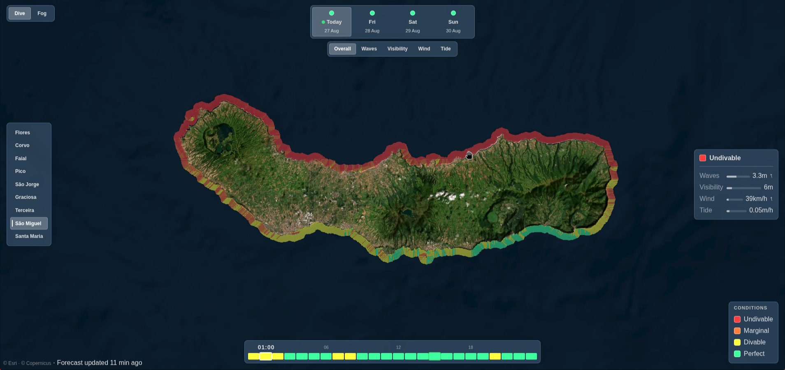
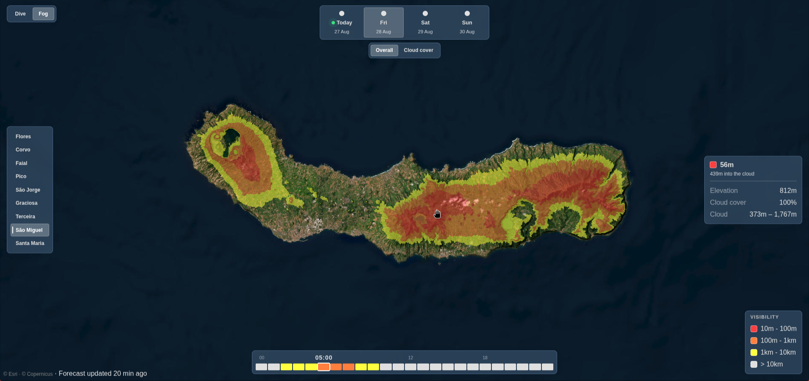

# AzorWatch

Two forecasts for the 9 Azores islands, today and the next 3 days, on a 50×50m color-coded map:
**Dive** conditions along the coast, and **Fog** over the land.

**Live demo:** https://afonsohj1812.github.io/AzorWatch

**Dive Mode:**


**Fog Mode:**


## Dive

Scores the 1km band of sea around each island for spearfishing. Four layers, each scored from
0 (perfect) to 1 (unusable) and combined by weight:

| layer      | from                              | perfect     |
| ---------- | --------------------------------- | ----------- |
| wave       | wave height, adjusted for shelter | small       |
| visibility | wave stir, rain runoff, daylight  | clear water |
| wind       | wind speed, adjusted for shelter  | calm        |
| tide       | rate of tide change               | moving fast |

Each cell knows which way its shore faces, so a swell running into the north coast scores worse
there than on the sheltered south side. That is why the two coasts differ in the screenshot.
Visibility decays from clear water as wave energy stirs the bottom, rain runs off the land, and
the light drops.

| class  | meaning   |
| ------ | --------- |
| red    | Undivable |
| orange | Marginal  |
| yellow | Divable   |
| green  | Perfect   |

## Fog

The forecast gives the height of the cloud base and cloud top over each island, and the
elevation grid gives the height of the ground at every 50m cell. A cell is foggy when its
elevation falls between the two, and the deeper it sits into the cloud, the lower the
visibility. That is why Pico's summit often stands in sunshine while its flanks are socked in.

If low cloud cover is under `cloudCover.minLow`, the hour is treated as cloudless and nothing
is painted, however humid the profile looks. Visibility inside cloud comes from the adiabatic
liquid water profile via Kunkel's relation.

| class  | visibility |
| ------ | ---------- |
| red    | 10m – 100m |
| orange | 100m – 1km |
| yellow | 1km – 10km |
| none   | > 10km     |

## Both

Those colors describe a single cell. The hour ticks and day circles use them for the island as a
whole: fog by how much land is covered, dive by the condition a quarter of the band beats.

An hourly job runs both models for all nine islands, renders every island-hour to a transparent
PNG and writes it to MongoDB, individual dive layers included. The API only reads from MongoDB,
so no request ever runs a model and switching layer or hour is just an image swap.

## Running it

Everything runs in Docker, including MongoDB.

```sh
docker compose up
```

Frontend on `localhost:5173`, backend on `localhost:3000`.

## API

| endpoint                                 | returns                                      |
| ---------------------------------------- | -------------------------------------------- |
| `GET /api/islands`                       | island list with bounding boxes              |
| `GET /api/forecast/:island`              | fog: 4 days × 24 hours of class              |
| `GET /api/sea/:island`                   | dive: the same, plus a class per layer       |
| `GET /api/fog/:island/:hour.png`         | fog overlay for one hour                     |
| `GET /api/sea/:island/:hour.png`         | dive overlay for one hour                    |
| `GET /api/sea/:island/:layer/:hour.png`  | one dive layer for one hour                  |
| `GET /api/point/:island/:hour?x=&y=`     | one cell: elevation, cloud base/top          |
| `GET /api/sea/point/:island/:hour?x=&y=` | one cell: every layer, its score and readout |

Summaries and pixels are separate on purpose: a summary is fetched once per island to color the
controls, the pixels are paged in an hour at a time as you scrub.

## Layout

```
backend/
  server.js                 the routes, plus the hourly cron
  export-static.js          writes the API as files for Pages
  config/
    islands.js              the nine islands and their bounding boxes
    model.json              every tunable constant, and the class colors
  services/
    fogMath.js  seaMath.js  the models, pure and Node-free, shared with the browser
    fogModel.js seaModel.js bind the models to the DEM and data, render the PNGs
    layers/                 one file per dive layer: its inputs, penalty and readout
    forecast.js surface.js  Open-Meteo fetches, cached
    marine.js               wave, tide, wind at sea, and rain over the land
    dem.js                  builds the elevation grids, then loads them
    db.js                   every MongoDB read and write
frontend/
  src/api.js                endpoint URLs, live or static
  src/components/           map, control panels, mobile menu
  src/composables/          data fetching and derived state
```

`server.js` and `export-static.js` are the only files you run. Adding a dive layer means one file
in `services/layers/` and one entry in `model.json`.

`fogMath.js` and `seaMath.js` have no filesystem or network access on purpose: the frontend
imports them directly, with `backend/services` and `backend/config` bind-mounted into the
frontend container, so the models and colors exist once rather than twice.

## Data

- Forecast and marine: [Open-Meteo](https://open-meteo.com), no API key.
- Elevation: Copernicus GLO-30 DEM, public on AWS.
- Basemap: Esri World Imagery.

## Limitations

- **Neither model is validated.** Every constant in `config/model.json` is standard physics or a
  plausible value chosen by hand. Nothing has been checked against observed fog, and the dive
  weights were tuned against a few dives off Terceira.
- **Shelter is not shadowing.** A cell knows which way its shore faces, not whether the island
  blocks the swell, so a bay behind a headland can still score as exposed.
- **Cloud cover is one number per island.** Above `cloudCover.minLow` the whole island is
  painted, below it none of it is, so 24% cover shows nothing and 25% shows everything. Partial
  cover is the common case here and is not drawn as partial.
- **The pressure levels cannot resolve a low cloud base.** The lowest two are ~110m and ~320m,
  and Azorean stratus routinely sits between them.
