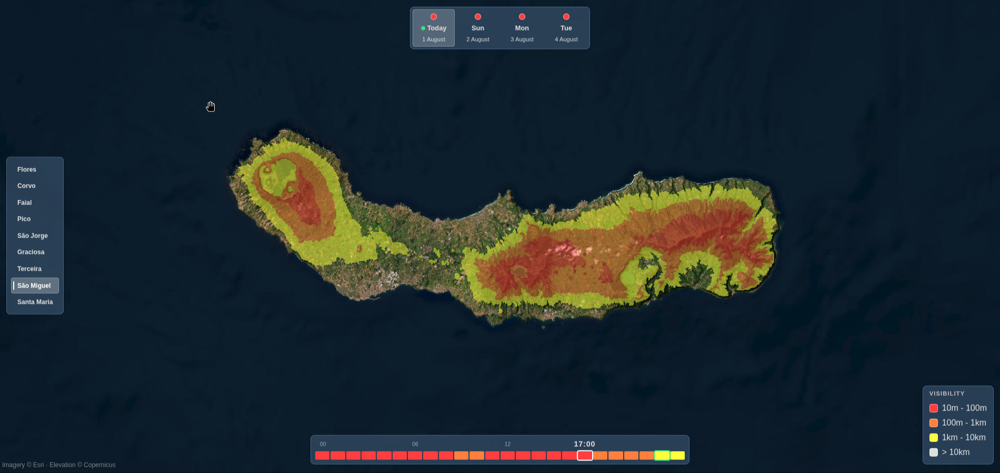

# BrumaWatch

An app that predicts fog across the 9 Azores islands for today and the next 3 days in a 50×50m color-coded map (no fog / yellow / orange / red).

**Live demo:** https://afonsohj1812.github.io/BrumaWatch (rebuilt every 6 hours, so the forecast can be a few hours behind).



## How it works

The forecast gives the height of the cloud base and the cloud top over each island. The elevation grid gives the height of the ground at every 50m cell. A cell is foggy when its elevation falls between the two, and the deeper it sits into the cloud, the lower the visibility.

1. **Forecast.** One Open-Meteo request covers all nine islands: surface temperature, dew
   point and wind, plus temperature, humidity and height on seven pressure levels from sea
   level to ~2000m.
2. **Vertical structure.** From that profile, find where the air reaches saturation (the
   cloud base) and where it dries out again (the cloud top).
3. **Terrain.** A 50m elevation grid per island, resampled from the Copernicus GLO-30 DEM.
4. **Intersect.** For each cell, compare its elevation with the cloud layer. Below the base
   is clear, inside it is fog that thickens with depth, above the top is clear again. That
   last case is why Pico's summit often stands in sunshine while its flanks are socked in.
5. **Serve.** Each island-hour is rendered as a small transparent PNG and drawn over a
   satellite map.

Visibility inside cloud comes from the adiabatic liquid water profile via Kunkel's relation,
bucketed into four classes:

| class  | visibility |
| ------ | ---------- |
| red    | 10m – 100m |
| orange | 100m – 1km |
| yellow | 1km – 10km |
| none   | > 10 km    |

Those colors describe a single 50m pixel. The hour ticks and day circles use the same colors
for a different thing, how much of the island is affected: an hour is yellow past 25% of the
land fogged, orange past 50% and red past 75%, and a day averages its 24 hours (red 3, orange
2, yellow 1, none 0) and takes the whole part.

## Running it

Everything runs in Docker.

```sh
docker compose up
```

Frontend on `localhost:5173`, backend on `localhost:3000`.

## API

| endpoint                             | returns                                              |
| ------------------------------------ | ---------------------------------------------------- |
| `GET /api/islands`                   | island list with bounding boxes                      |
| `GET /api/forecast/:island`          | 4 days × 24 hours of class, plus conditions (~17 KB) |
| `GET /api/fog/:island/:hour.png`     | the overlay for one hour (1–30 KB)                   |
| `GET /api/point/:island/:hour?x=&y=` | one cell: elevation, cloud base/top, visibility      |

The forecast summary and the pixels are separate on purpose. The summary is small and fetched
once per island to color the day and hour controls, while the pixels are paged in one hour at
a time as you scrub. Its `conditions` array also carries the cloud base, top and the depth
thresholds, which is what lets the static build classify a single cell in the browser with no
server behind it.

## Layout

```
backend/
  api.js                    all routes
  shared/
    fogMath.js              the model, pure and Node-free, shared with the browser
    islands.js              the nine islands and their bounding boxes
  services/
    forecast.js             Open-Meteo fetch + cache
    fogModel.js             wraps fogMath with the DEM, forecast and caching
    dem.js                  loads the elevation grids
    render.js               class grid -> PNG
  scripts/
    prepare-dem.js          one-off DEM preparation
    export-static.js        writes the API as files for Pages
  config/fogModel.json      every tunable constant
frontend/
  src/api.js                endpoint URLs, live or static
  src/lib/dem.js            reads the .bin grids in the browser
  src/components/           map + the four control panels
  src/composables/          data fetching and derived state
```

`fogMath.js` has no filesystem or network access on purpose: the frontend imports it directly
(bind-mounted in development, copied in CI) so the fog model exists once, not twice.

## Data

- Forecast: [Open-Meteo](https://open-meteo.com), no API key.
- Elevation: Copernicus GLO-30 DEM, public on AWS.
- Basemap: Esri World Imagery.

## Limitations

- **It predicts the height range a cloud would occupy, not whether there is a cloud.** The
  profile always yields a base and a top, and every land cell between them is painted as fog.
  Nothing in the pipeline ever establishes that cloud actually exists over that island at that
  hour. On a humid but cloudless day the numbers still produce a base a few hundred meters up,
  so the high ground is shown as fogged under a clear sky, and the app has no way to tell that
  case apart from a real deck. This is the single largest source of false fog.
- **The model is not validated.** Every constant in `config/fogModel.json` is either standard
  physics or a plausible value chosen by hand and checked against a single day of output.
  Nothing has been compared against observed fog. It is a physically reasoned estimate, not a
  verified forecast.
